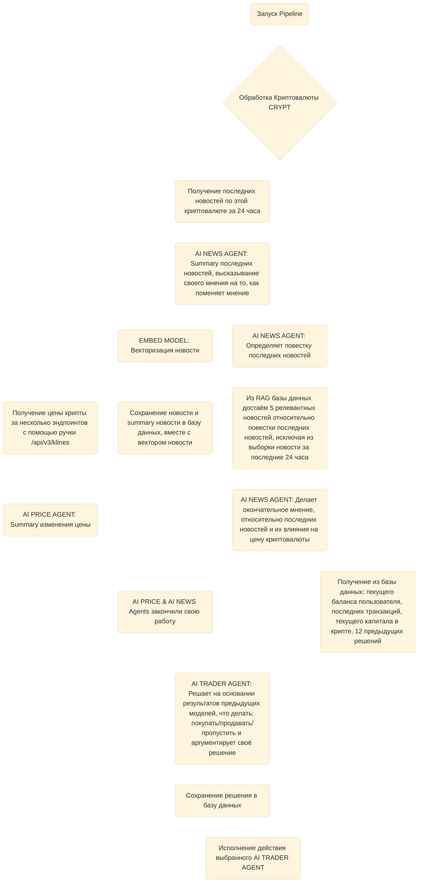

# Задача

Реализовать AI-Trader с mock-сделками и отслеживать реальный результат на реальных данных по API

## Подробности задачи

- Создать систему AI-агентов, которые в команде будут работать с криптой: покупать/продавать
- Под AI-агентами имею в виду хардкод логику + LLM вызовы по API OpenRouter
- Мы должны высчитывать все комисси, чтобы результат получился максимально честным. За вычисление комиссий отталкиваемся от Binance

### Архитектура решения

PipeLine будет запускать 4 раза в сутки:
1. 00:00 по utc+0
2. 06:00 по utc+0
3. 12:00 по utc+0
4. 18:00 по utc+0
(или режим раз в N минут, при включении сразу начинает pipeline с нуля. Должна быть смена режима через `.env`)

Будем работать с 3 криптовалютами:
1. BTC - Bitcoin
2. ETH - Ethereum
3. TON - Toncoin
p.s. Тут нужно будет применить SOLID, чтобы для каждой крипты был 1 интерфейс, а не код 1 в 1 копирующийся, меняющий константы

Pipeline:


### Технический регламент

- python 3.12+
- asyncio
- poetry
- docker compose
- PostgreSQL (pgvector)
- alembic
- pytest
- aiogram3
- sqlalchemy
- pydantic-settings

#### Правила

- Каждой функции и каждому классу пишем описание на русском языке в стиле google
- Внутри функций и больших кусков кода оставляем комментарии на русском, комментируя логические действия
- Пользуемся философией ООП и SOLID
- Для логирования используем loguru, логгировать код обязательно, но полезно, сохраняя loguru.bind
- При написании новых кодов или изменении существующих пишем/переписываем @tests\
- Наполняй `config.py` всегда изменяемыми переменными, но тоже не борщи, без черезмерно энтузиазма
- Все взаимодействия с базой данных через `app.crud`
- При изменении `config.py` меняй `.env.example`
- В `config.py` нужно распределять всё по классам, чтобы не было большого `class Settings` со всем в мире

#### Предлагаемая архитектура prototype

```
- .env
- .env.example
- docker-compose.yml
- docs\
- scipts\
- tests\
- app/
-- main.py
-- config.py
-- models\
-- crud\
-- services\
```

### Модели

- Модель init, в ней изначальные данные пользователя (стартовый капитал, данные пользователя, всего 1 запись, создаваемая вручную, написать доку небольшую для инициализации поля)
- Модель транзакций, в ней все транзакции
- Модель с решениями AI TRADER AGENT
- Модель с новостями (тут векторизация)
- Модель с вызовами к llm*

*Для этой модели нужно будет создать класс, который будет отвечать за все вызовы к моделям. У него следующий pipeline:
- Создание записи в модели с статусом IN_PROGRESS
- Вызов модели
- Если результат положительный: то меняем на COMPLETE и дописываем поля необходимые
- Если результат отрицательный: то меняем на ERROR и дописываем поля необходимые

### Роль телеграм бота

Телеграм бот должен будет отписывать в личные сообщения пользователю (telegram_id в модели init будет указан):
- После отработка шага pipeline для каждой крипты отписывает результат, что сделал или не сделал summary (то есть после всех шагов для одной крипты)
- При каждой транзакции пишет, что купил/продал и как от этого изменился баланс пользователя и делает summary (выгодно или нет и насколько)
- После отработки всего pipeline пишет summary по статусу кошелька и последних действиях за этот pipeline (то есть после все крипт, то есть после всего loop)
