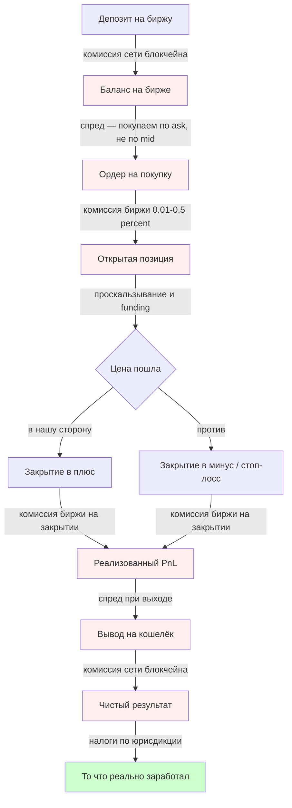
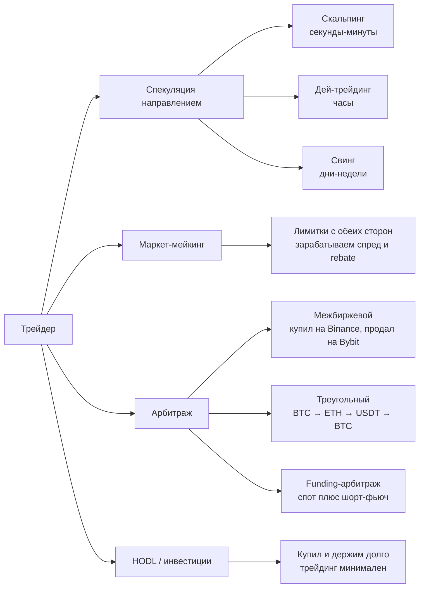

# Как зарабатывают крипто-трейдеры — теория с нуля

## Базовая идея

Трейдер зарабатывает на **разнице цен**: купил дешевле — продал дороже (или наоборот: продал дороже — выкупил дешевле, это «шорт»). Прибыль = (цена продажи − цена покупки) − все издержки.

Главный нюанс: **издержек больше, чем кажется**. Если их не учитывать, можно «угадать направление» и всё равно остаться в минусе.

## Основные термины

- **Ордербук** — список заявок на покупку (bids) и продажу (asks). Самая высокая цена покупки и самая низкая цена продажи формируют **спред**.
- **Спред (spread)** — разница между лучшей ценой продажи и лучшей ценой покупки. Это скрытая «комиссия» рынка.
- **Мейкер (maker)** — кто ставит лимитный ордер и ждёт, добавляя ликвидность. Комиссия ниже.
- **Тейкер (taker)** — кто бьёт по рынку и забирает чужой ордер сразу. Комиссия выше.
- **Проскальзывание (slippage)** — реальная цена исполнения хуже ожидаемой, потому что объёма по лучшей цене не хватило.
- **Funding rate** (для бессрочных фьючерсов) — периодическая плата между лонгами и шортами для удержания цены контракта около спота.

## Где трейдер теряет деньги на каждой сделке

## Подробнее — где деньги «утекают»

| Этап | Что теряем | Порядок величины |
|---|---|---|
| Депозит крипты на биржу | Комиссия сети (gas) | $0.1–$30 в зависимости от сети (BTC/ETH дороже, TRC20/Solana дешевле) |
| Покупка | Спред | 0.01–1% (на ликвидных парах — копейки, на «мусорных» — много) |
| Покупка | Комиссия биржи | 0.01–0.5% (taker ≈ ×2 от maker) |
| Удержание позиции | Funding (только фьючерсы) | ±0.01–0.1% каждые 8 часов |
| Большой ордер | Проскальзывание | от 0 до десятков % на неликвиде |
| Продажа | Комиссия биржи ещё раз | те же 0.01–0.5% |
| Продажа | Спред ещё раз | те же 0.01–1% |
| Вывод на свой кошелёк | Комиссия сети + фикс. сбор биржи | $1–$30 |
| Конец года | Налог на прибыль | 13–30% по юрисдикции |

**Вывод:** чтобы выйти в ноль на одной сделке spot, движение цены должно покрыть ≈ 0.1–0.4% издержек (две комиссии + два спреда). На фьючах добавь funding.

## Как именно трейдеры зарабатывают — основные подходы

### Коротко по подходам

- **Спекуляция** — самый популярный и самый рискованный путь. Прибыль = ставка на направление. Большинство новичков теряют деньги именно тут.
- **Маркет-мейкинг** — зарабатываешь на спреде, ставя лимитные ордера с двух сторон. Требует низких комиссий (VIP-уровни) и автоматизации. Без бота не работает.
- **Арбитраж** — ловишь разницу цен между биржами или между инструментами. Безопаснее по идее, но margins маленькие, нужна скорость и автоматизация.
- **HODL** — не совсем трейдинг, но многие к этому приходят, осознав, сколько съедают комиссии.

## Что важно понимать новичку

1. **Комиссии и спред — главный враг**. Чем чаще торгуешь, тем больше отдаёшь бирже. Скальпер за день может прокрутить депозит 50 раз — это 50 × (комиссия + спред).
2. **Плечо (leverage) усиливает не только прибыль, но и комиссии и риск ликвидации**. На x10 ликвидация наступает уже при движении ~10% против тебя.
3. **Funding rate на фьючах** может незаметно съесть позицию за неделю удержания.
4. **Налоги существуют** даже если биржа их не удерживает — это ответственность пользователя.
5. **Статистика жёсткая**: по разным оценкам 70–90% розничных трейдеров теряют деньги в первый год. Поэтому имеет смысл сначала строить инфраструктуру (бот, бэктест, риск-менеджмент), а потом торговать реальными деньгами.

## Связанные файлы

- [api-table.md](api-table.md) — где брать цены по API
- [price.md](price.md) — комиссии бирж + их API
